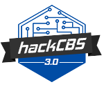

##
## Project submission for HackCBS 3.0 on 8th November 2020

# ANNOTATE ME 

#### Interactive video streams for your online meetings.

#### annotate-me lets you add interactive emojis to your web conferencing platform. It uses TensorFlow JS to detect the users gestures and overlays a clip art on the screen.

#### This will help other's in the meeting to easily see the user's reaction.

#### Currently we have to use Open Brodcaster Software for displaying the video but our original goal was to not use any 3rd party software but after implementing the web sdk ZOOM meeting app provides we got to know that they don't provide full customization to their sdk yet.

#### You can run the TFJS project on your localhost and use a tool like OBS to use it as the video feed for platforms like Zoom and Google Meet replacing your webcam and overlaying it with annotate-me.

Check this [link](https://youtu.be/wAGjN4fJQ24) for the demo.

### OR

### Steps to setup
<pre>
- Clone the repo 

# open new terminal window and
- cd sample-app-web/cd websdk-sample-signature-node.js 
- npm install
- npm run start
- a signature server will be setup after this

- cd sample-app-web/Local
- npm install
- npm run https
- open the url at which the local host is running

Finally
- cd sample-app-web/annotate-me
- run a live server for eg - lite-server

#visit the local host url and start the meeting with your meeting id and password.

</pre>

#
